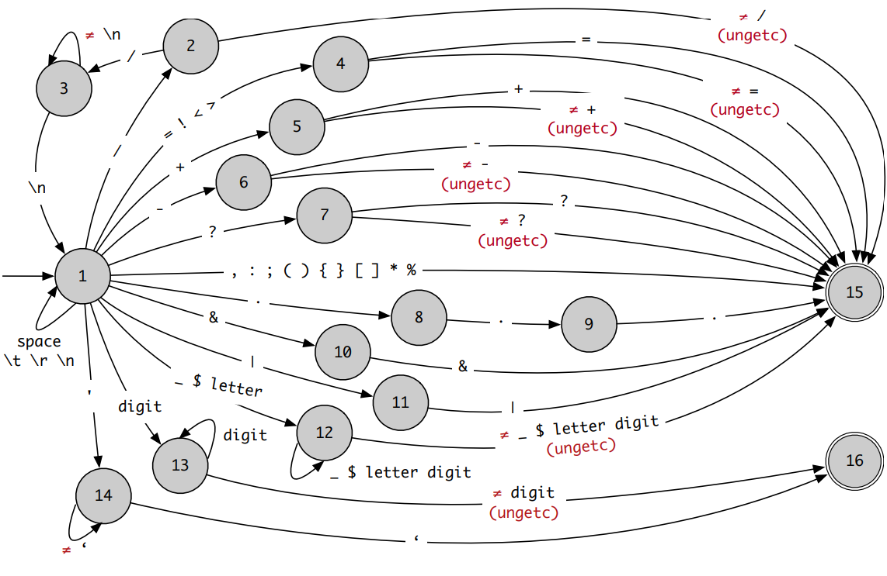
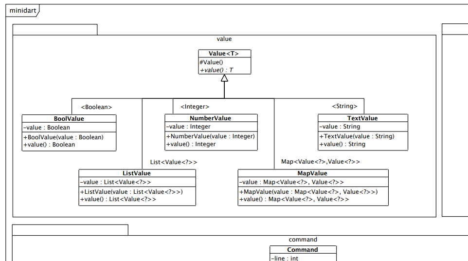

# mini-dart
This project was made for Programming Language Subject at college.

# Objective
Build from scratch a programming language interpreter. This project is inspired in [Dart](https://dart.dev/) syntax and semantics.

# Developing
## Step 1:
Using a lexical automata to the lexemes of the language:


## Step 2:
Using a grammar in EBNF to make the parsing of the Programming Language. This grammar is incomplete and full grammar is available in [TP1.pdf](TP1.pdf) file.

```
<code> ::= { <cmd> }
<cmd> ::= <decl> | <print> | <assert> | <if> | <while> | <dowhile> | <for> | <assign>
<decl> ::= [ final ] var [ '?' ] <name> [ '=' <expr> ] { ',' <name> [ '=' <expr> ] } ';'
<print> ::= print '(' [ <expr> ] ')' ';'
<assert> ::= assert '(' <expr> [ ',' <expr> ] ')' ';'

```

## Step 3:
Implement the semantic of the interpreter, based on the last file of the PDF - it's a class diagrams. Preview of the file below.



# Running the project
To run the project, use the following command:
```
java mdi examples/hello.mdart